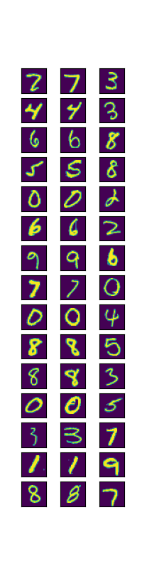
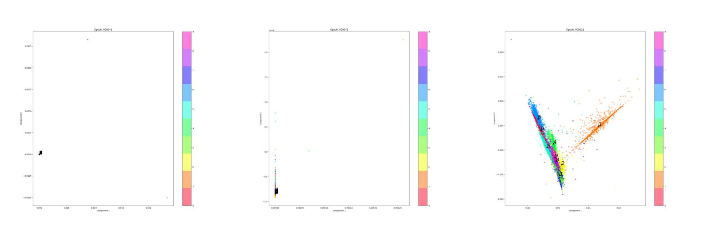
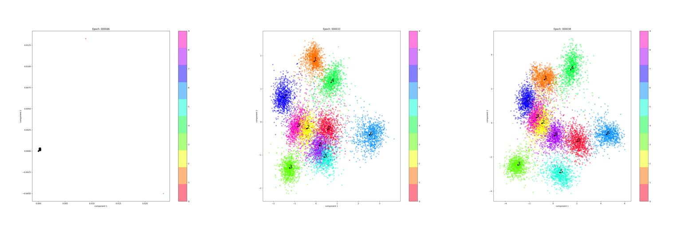
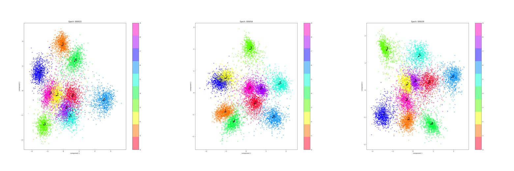
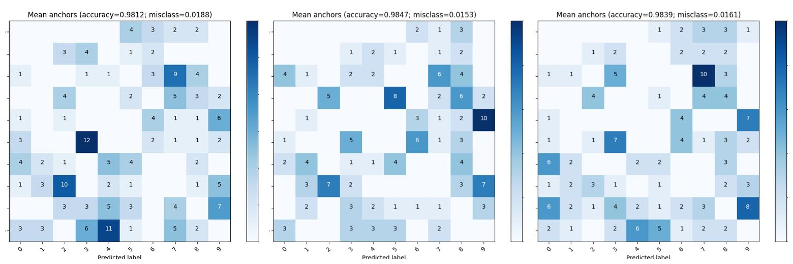
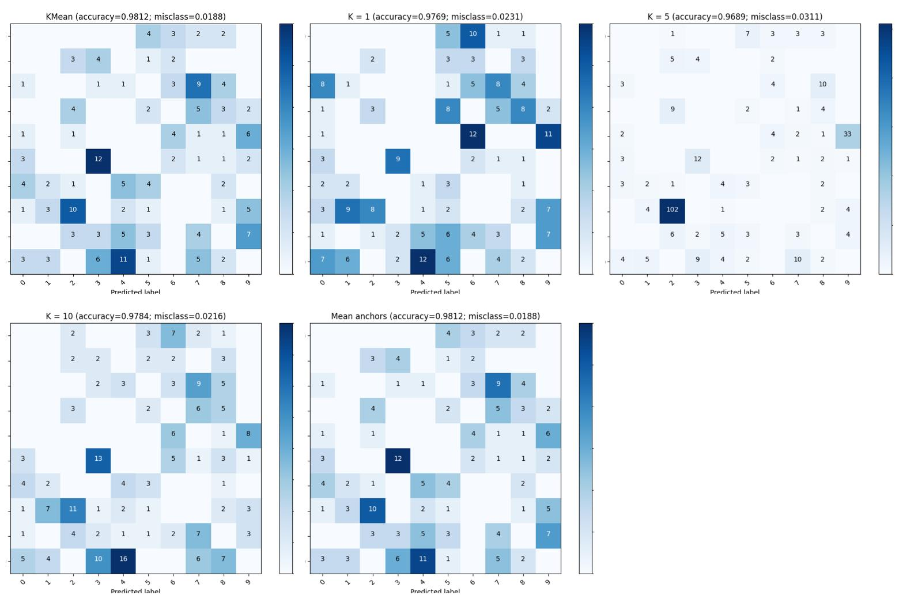
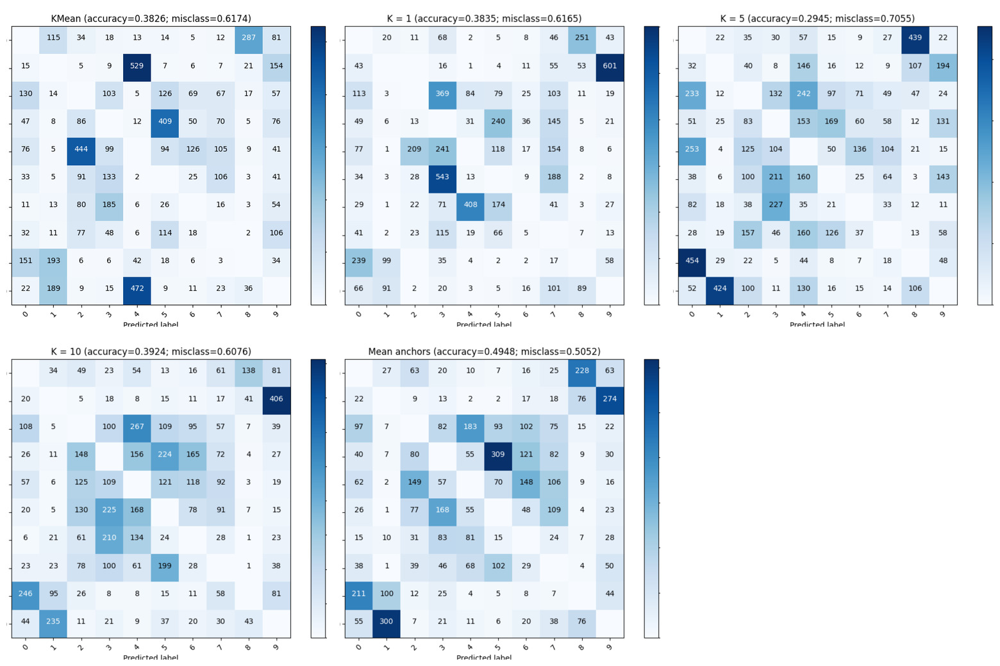
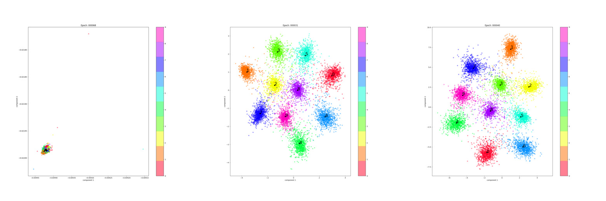
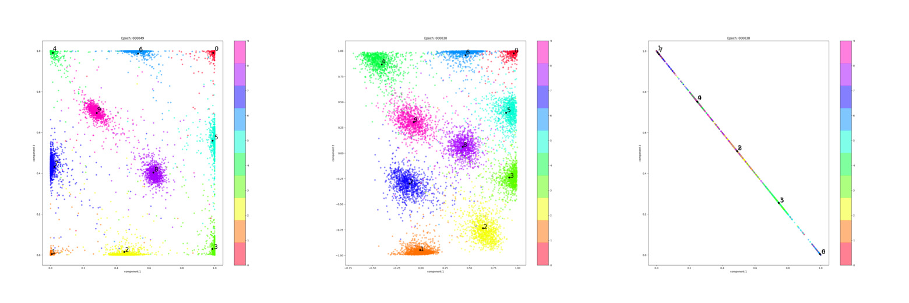

# Отчёт

Сиамская сеть представлена классом [CSiameseNetwork](../CSiameseNetwork.py) и имеет следующие особенности:

- Класс наследуется от `keras.Model`, что позволяет использовать все возможности метода `fit`.
- В основе лежит обычная сеть, с одним входом и одним выходом, вместо работы с сетью имеющей два входа и один выход. Это позволяет более эффективно и гибко работать с сетью.
- Метод `latent` возвращает выученное представление для входных данных.
- Метод `compareOne` позволяет эффективно сравнить `sample` с латентными представлениями `anchors`.
- `train_step` (точнее, `_loss`) более эффективно выполняет прогон сети, избегая усложнения архитектуры сети и/или лишнего прогона для `anchors`.
- Используется стандартный `triplet loss` и, по умолчанию, евклидово расстояние между латентными представлениями.

Сиамской сети необходимо формировать триплеты примеров, поэтому был реализован [CTripletsGenerator](../CTripletsGenerator.py). Этот класс проходится, на каждой эпохе, по **всем** элементам датасеты и генерирует к ним случайные пары. Не скажу насколько это эффективнее заранее созданных триплетов, но это идеологически более корректно.

Практически все эксперименты проводились на датасете MNIST т. к. он наиболее наглядный и простой. Примеры сформированных триплетов:



Модель имеет следующую архитектуру (для MNIST, при размере латентного представления 8):

```
_________________________________________________________________
Layer (type)                 Output Shape              Param #   
=================================================================
input_1 (InputLayer)         [(None, 28, 28, 1)]       0         
_________________________________________________________________
conv2d (Conv2D)              (None, 13, 13, 16)        160       
_________________________________________________________________
batch_normalization (BatchNo (None, 13, 13, 16)        64        
_________________________________________________________________
conv2d_1 (Conv2D)            (None, 6, 6, 32)          4640      
_________________________________________________________________
batch_normalization_1 (Batch (None, 6, 6, 32)          128       
_________________________________________________________________
conv2d_2 (Conv2D)            (None, 2, 2, 64)          18496     
_________________________________________________________________
batch_normalization_2 (Batch (None, 2, 2, 64)          256       
_________________________________________________________________
flatten (Flatten)            (None, 256)               0         
_________________________________________________________________
dense (Dense)                (None, 256)               65792     
_________________________________________________________________
dense_1 (Dense)              (None, 128)               32896     
_________________________________________________________________
dense_2 (Dense)              (None, 8)                 1032      
=================================================================
Total params: 123,464
Trainable params: 123,240
Non-trainable params: 224
```

## Влияние параметра alpha/margin.

Если совсем сжато, то этот параметр предотвращает схлопывание латентного представления, вынуждая сеть искать более разнесённое в пространстве представление признаком. Если этот параметр равен нулю, то, в итоге, можно наблюдать следующие примеры ситуации:



Стоит заметить, что коллапс происходит не сразу и модель некоторое время способна функционировать. После коллапса же признаки становятся непригодными и точность классификации едва ли достигает 15%.

Латентное представление той же сети, но с margin равным 0.0, 1.0 и 4.0:



## Влияние размера латентного представления.

Проекции латентного представления размерами 8, 32 и 128:



Матрицы ошибок этих же сетей:



Мысли и предположения:

- С ростом размера латентного представления растёт и обособленность кластеров в пространстве.
- Прибавка в точности модели растёт далеко не линейно. Более того, слишком большое латентное представление может ухудшить точность классификации.

## Способы классификации на основе сиамской сети.

Я протестировал следующие варианты:

- использование KMeans на основе латентного представления;
- использование `K` случайных примеров **каждого** класса из выборки и поиск наиболее близкого/похожего;
- формирование усреднённого представления **каждого** класса из выборки и поиск наиболее близкого/похожего.

Все три способа можно "обучить" используя весь датасет, но посчитал более логичным использование только обучающей выборки.

Матрицы ошибок для этих трёх способов (сеть одна и та же):



Второй метод даёт меньшую точность, но и требует существенно меньше предобработки. Кроме того, даже при `K = 1` точность достаточно высока, что весьма важно для случаев когда слишком затратно обрабатывать всю выборку. При `K = 5` система становится слишком чувствительной в некоторых областях пространства признаков, но с ростом `K` этот эффект, предполагаю, снижается.

Первый и третий способ показывают практически идентичные результаты на MNIST, но вот матрица ошибок для CIFAR10:



Тут уже картина абсолютно иная т. к. датасет намного сложнее (см. [примеры триплетов](cifar_triplets.png)). Предполагаю, что третий способ демонстрирует существенно большую точность т. к. находит центры кластеров в соответствии с классами, а не исключительно на основе латентного представления, как в случае с KMeans, или выбирая их случайным образом.

## Поведение латентного представления.

Проекция PCA вносит сильные искажения в восприятие латентного представления, поэтому я задал размер равным 2 и напрямую пронаблюдал его. Так выглядит итоговое латентное представление при margin равным 0.0, 1.0 и 4.0:



Анимация процесса их обучения: [0.0](latent_2d_0.gif), [1.0](latent_2d_1.gif), [4.0](latent_2d_4.gif).

Латентное представление при различных функциях активации (sigmoid, tanh и softmax, просто из интереса) и `margin = 0.1`:



Softmax благополучно схлопнулся, что вполне ожидаемо, а вот sigmoid смог достичь точности в 97.8%.