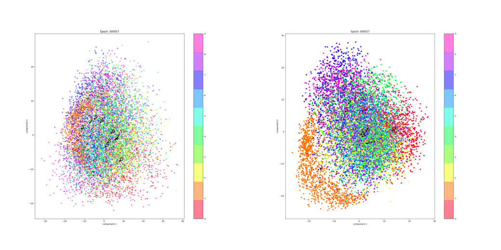
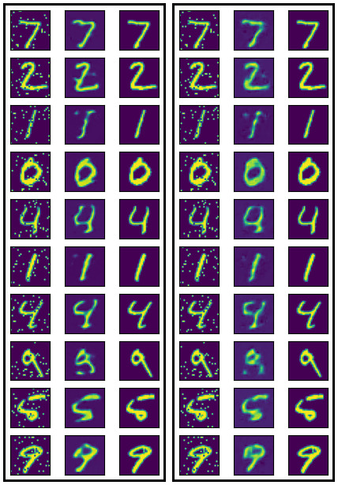
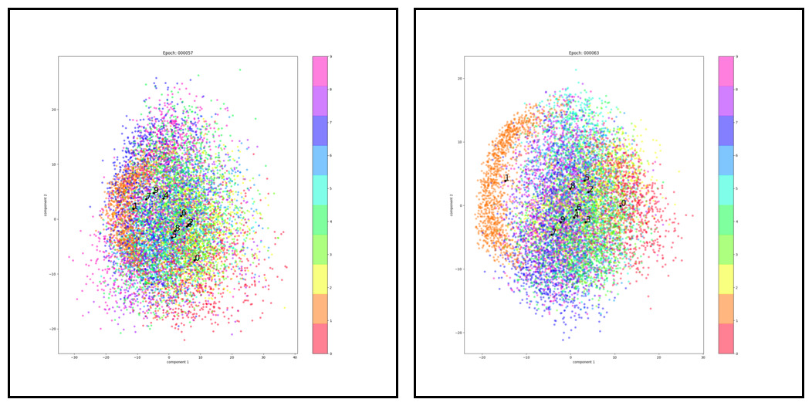
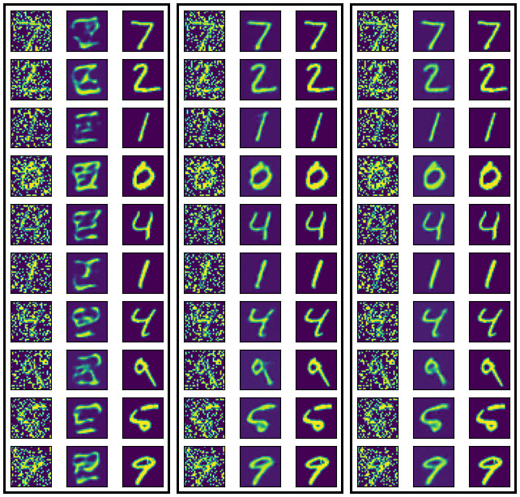
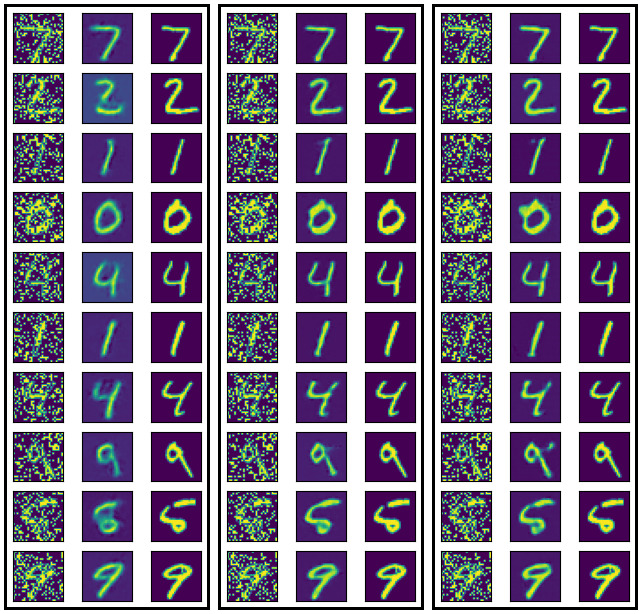

# Отчёт

Структура кода:

- [CAutoencoderNetwork.py](../CAutoencoderNetwork.py) - простая обёртка над автокодировщиком. Предоставляет метод `latent` для получения латентного представления.
- [CAEPairsGenerator](../CAEPairsGenerator.py) - генерирует данные для обучения автокодировщика, добавляя во входные данные заданный процент случайных инвертированных пикселей.
- [autoencoder_network.py](../autoencoder_network.py) - содержит код самого автокодировщика и экспериментов с ним. Encoder VAE возвращает сэмпл из латентного представления, а не его параметры, что упрощает сбор данных, но скрывает истинное латентное представление.
 
Все эксперименты проводились на датасете MNIST т. к. он наиболее наглядный и простой.

## Сравнение Variational AutoEncoder с простым AutoEncoder-ом.

Сравним латентное представление обычного автокодировщика и вариационного:

Оба автокодировщика имеют размер латентного представления равный 32 и обучались с 0% шума. Вариационному автокодировщику потребовалось порядка 25 эпох, в то время как обычный обучался около 60 и не достиг той же точности. Впрочем, каких либо значимых и, главное, систематических отличий  в их латентных пространствах нет. В целом, оба типа автокодировщиков имеют равные шансы найти более выразительные признаки.

(Столбец 1 - подаваемые данные, столбец 2 - предсказание сети, столбец 3 - исходное изображение)

Оба автокодировщика проявляют небольшую устойчивость к шуму. VAE демонстрирует стабильно более качественные результаты работы, с менее заметными искажениями.

## Влияние наличия шума в обучающей выборке.

Латентное представление AE с пространством 32, но обучающихся на данных с 0% и с 10% шума:

Как видно, добавление шума вынуждает сеть учить особенности присущие отдельным классам. Например, все автокодировщики, в той или иной мере, стремятся максимально отделять 0 и 1,  представляя остальные цифры степенью похожести на них.

Если провести классификацию на основе латентного представления, то обученная без шума имеет точность в районе 75%, с 10% шума - 80%, с 30% - 85%.

Устойчивость к шуму так же значительно возрастает. Ниже примеры работы сетей обученных с 0%, 10% и 30% шума:

Добавление даже 10% шума при обучении позволяет сети успешно реконструировать данные с 30% шума.

С VAE ситуация аналогична, но менее показательная, в силу большей точности.

## Влияние размера латентного представления.

Латентное представление AE с пространством 8, 32 и 128, обучающихся на данных с 10% шума:

В силу простоты датасета MNIST, размер латентного представления почти не играет роли.